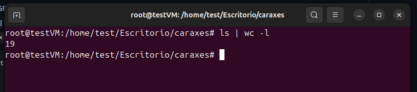

# Archivos ocultos, rootkits y hooks de syscalls: razones para desactivar la importación de módulos

Si hago `ls` en este directorio y contamos los resultados podemos ver como hay 19 resultados.

<figure><figcaption></figcaption></figure>

Ahora insertaré un modulo al kernel y repetiré la accion sin borrar nada. Por qué no salen los archivos que tienen el nombre caraxes? Hay algo mal con el comando ls? No se ha borrado ningún  archivo y la respuesta da mas miedo que lo normal. Incluso si pruebo, puedo ejecutar un archivo que no parece estar en el directorio.

<figure><figcaption></figcaption></figure>

Algo debe de estar pasando para que no se listen archivos que están en el directorio.&#x20;

### Rootkits

Para entender que esta pasando y que son los linux rootkits hay que saber que es un rootkit. Citando a wikipedia:&#x20;

> A rootkit is a collection of computer software, typically malicious, designed to enable access to a computer or an area of its software that is not otherwise allowed (for example, to an unauthorized user) and often masks its existence or the existence of other software.

Para ser mas  especifico aquí estaremos hablando de los kernel rootkits, en un idioma mas normal esto es malware(en nuestro caso) que modificara el comportamiento normal de este.&#x20;

Entonces, que malware esta afectando aquí a ls y que tiene que ver con el  kernel? Bueno pues la clave esta en que en linux existen un numero de funciones llamadas syscalls que hacen la vida mas fácil al programador que necesita ciertas cosas del sistema, como podría ser abrir un archivo o listar los contenidos de un directorio o crear un directorio. Esta es la lista de todas las syscalls (64 bits)[https://syscalls64.paolostivanin.com/](https://syscalls64.paolostivanin.com/)  \
\
Estas funciones se usan por ejemplo cuando se usa el comando ls (no es que se usen, es que el binario escrito en C las llama). Esto lo podemos ver ejecutando el siguiente comando strace + ls&#x20;

<figure><figcaption></figcaption></figure>

El comando llama a muchas mas syscalls pero lo que nos interesa  es la llamada a getdents64. Si hacemos un man de la funcion veremos que nos dice cual es su trabajo.&#x20;

<figure><figcaption></figcaption></figure>

En palabras de ChatGPT:

> `getdents64` es una syscall de Linux que lee las entradas de un directorio.\
> Devuelve información de cada archivo o carpeta, como nombre, tipo e inode.\
> Se usa internamente cuando programas llaman a `readdir()` para listar directorios.

Por lo tanto ahora sabemos que es aquí donde se listan los nombres de archivos y carpetas. Entonces si tuvieramos acceso a modificar esta funcion y decirle que que no devuelva cualquier archivo o  carpeta que contenga en el nombre una cadena como por ejemplo \*caraxes\*  tendríamos una herramienta muy poderosa para la persistencia en sistemas hackeados ya que no se podría listar nuestro malware.&#x20;

Pero, ¿Cómo decirle al kernel que no use esa funcion y use una nuestra pre fabricada para que podamos ocultar determinados archivos? Bueno, la verdad es que esto no es necesario. Lo minimo que necesitamos es que  cuando se llame a esta función antes se pase por una nuestra. De esta forma podremos controlar que mostramos en el userspace y que no.&#x20;

### Ftrace, el HOOK

Mi conocimiento es limitado en C y perderias el tiempo leyendo una mala explicacion mia de como ftrace nos sirve para hookear una syscall así que para no hacerte sufrir te dejo aquí el recurso de donde yo he aprendido este concepto [https://xcellerator.github.io/posts/linux\_rootkits\_02/#function-hooking-with-ftrace](https://xcellerator.github.io/posts/linux_rootkits_02/#function-hooking-with-ftrace). Es importante leer rootkits\_01 (\*IDOR\*)antes para entenderlo todo.

Asumiendo que ya has leido los articulos verás que el flujo es claro: ls -> hook\_getdents64 -> getdents64. Para verlo con codigo podemos fijarnos en el exploit de Caraxes [https://github.com/ait-aecid/caraxes](https://github.com/ait-aecid/caraxes).&#x20;

Sin entrar en muchos detalles el flujo es el siguiente como he comentado antes, llamamos a getdents y despues pasamos nuestras reglas (evil)

<figure><figcaption></figcaption></figure>

Aquí en evil lo importante es esta parte del codigo  en la cual podemos ver que si la entrada contiene la magic word (caraxes de default) o es un determinado usuario o grupo eliminaraemos la entrada por lo que no se mostrará.  &#x20;

<figure><figcaption></figcaption></figure>

Aquí el trabajo hookear una funcion a otra lo hace ftrace pero para indicar que partes del codigo son teneis que ver el array declarado aquí en el que le decimos lo que queremos sustitiuir y por qué&#x20;

<figure><figcaption></figcaption></figure>

Y después vemos que simplemente en el archivo principal usamos la libreria ftrace para inyectar  nuestros hooks previamente definidos

<figure><figcaption></figcaption></figure>

Bien con todas las herramientas listas solo queda ejecutar make para compilar. Nos dejará un archivo .ko el cual podremos importar como un modulo al kernel con el comando insmod caraxes.ko&#x20;

<figure><figcaption></figcaption></figure>

Y ya estaría listo. Ahora ocultamos archivos que tienen el nombre caraxes.&#x20;

Esto es solo una de las muchas aplicaciones que esta tecninca puede tener, pero creo que se puede  apreciar lo peligroso que es esto. Una posible mitigación al menos temporal  es ejecutar el siguiente comando para desactivar la importación de modulos `echo 1 > /proc/sys/kernel/modules_disabled`   &#x20;

&#x20;Esto solo evita la importacion de módulos al kernel hasta el siguiente reboot que ya es algo si tenemos un servidor que no planeamos apagar nunca.&#x20;

Y como saber no saber es de sabios aquí confieso que no tengo claro como mitigar esto mas de haya de lo que acabo de comentar. Si sabes algun método mas profesional estaré agradecido y lo pondré por aquí con los debidos creditos al informador. Eso es todo espero que haya sido mínimamente interesante.&#x20;

Referencias:

[https://github.com/ait-aecid/caraxes](https://github.com/ait-aecid/caraxes) el exploit\
[https://xcellerator.github.io/posts/linux\_rootkits\_01/](https://xcellerator.github.io/posts/linux_rootkits_01/) explicación a fondo de como funciona todo esto\
[https://www.youtube.com/@hacktheclown/videos](https://www.youtube.com/@hacktheclown/videos) de donde he sacado la idea

